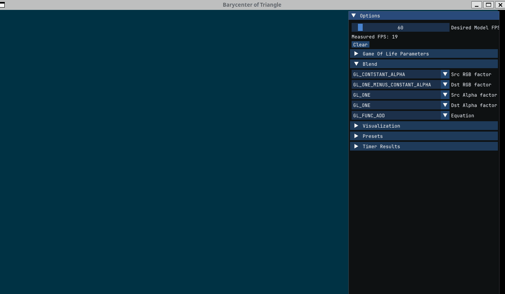

Thanks to [Cervidellus/GameOfLife](https://github.com/Cervidellus/GameOfLife), I can learn a lot about SDL3, ImGUI and OpenGL.



Play around with cellular automata!


Here is what you can do:

1. Change the speed of model updates.
  Sometimes it is fun to slow it down so you can see what is going on.
  At the top of the Options menu you can select a desired FPS.
2. Change the rules of the game of life.
   In the Game of Life Parameters window you can change the size of the model as well as how the rules are implemented.
   This can yield some strange and fun results. I
   To change the size, you first have to pause the model and then click generate.
3. Change the colors.
   Choose the color map under the visualization tab.
   The default right now is DualColor, which allows you to choose different colors for alive vs. dead cells.
   Try selecting something like Plasma instead!
4. Select a preset.
   In the presets menu select a preset.
   I've put several well known conway's game of life models in there.
   There aren't many yet, but I plan on adding more when I get the time.
5. Load a model from file, or copy and paste from the web!
   To load from file rowse the excellent https://conwaylife.com/wiki/ and download it.
   Then under the presets menu select From File and point to it's path.
   Or, you can just copy the RLE encoded model from the same website, select From String and paste it in there!
6. Get some debug info under the Timer Results tab.


Build Instructions:
It uses a pretty standard CMAKE build.
Make sure to get the submodules when you clone:
```
git clone --recurse-submodules https://github.com/Cervidellus/GameOfLife.git

cd GameOfLife
mkdir build 
cd build
cmake ..
cmake --build . --config Release
```

A Binary for Windows is available in the latest release.
   
  


